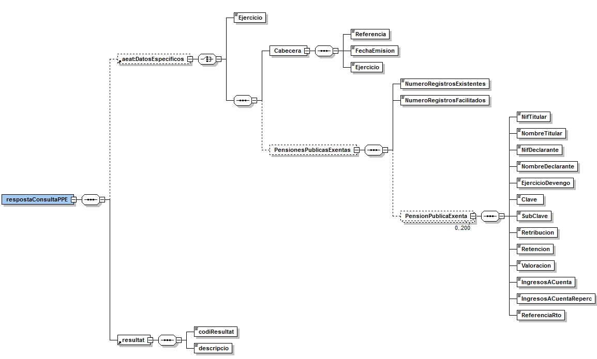

# Via Oberta – Agència Tributària (AEAT)
Document d’integració del servei.

Podreu trobar els XSD's del servei en aquest repositori sota el directori [/schema](https://github.com/ConsorciAOC/VO-AEAT/tree/main/AEAT-schemes_v2021).

## Control del document

### Informació general

| **Títol:** | Via Oberta – AEAT. Document d’integració del servei|
| --- | --- |
| **Creat per:** | Àrea de Tecnologia – Unitat de Projectes |
| **A revisar per:** | Àrea de Tecnologia – Unitat de Suport |
| **A aprovar per:** | Àrea de Tecnologia – Unitat de Suport |
| **Llista de distribució:** | |
| **Nom del document:** | DI - Via Oberta - AEAT.doc |

### Històric de revisions

| **Versió** | **Data** | **Autor** | **Comentaris** |
| --- | --- | --- | --- |
| V1.1 | 21/03/2011 |  Roger Noguera i Arnau | Creació del document |
| V1.2 | 16/04/2012 | Roger Noguera i Arnau  | Incorporació de modalitats d’IRPF i nous codis de producte.	 |
| V1.3 | 10/10/2012 | Roger Noguera i Arnau  | Nova codificació del productes |
| V2.0 | 21/11/2012 | Roger Noguera i Arnau  | AEAT10X: nous codis de retorn. IRPF:  elements de corresponents a part entera i decimal de les caselles opcionals arran de canvis en el servei de l’emissor. |
| V2.1 | 01/03/2013 | Roger Noguera i Arnau  | Incorporació de modalitat Pensions Públiques Exemptes (PPE)  |
| V2.2 | 06/09/2013 |Roger Noguera i Arnau   | Adaptacions de missatgeria derivats de nou servei IRPF de l’AEAT |
| V2.3 | 04/06/2014 | Roger Noguera i Arnau  | Revisió de les modalitats AEATIAE i SCPWIJ1R arran dels canvis de plataforma a l’AEAT (missatgeria compatible). Obligatorietat d’informar les dades del funcionari. |
| V2.4|  07/07/2014 | Llorenç Camps Vicente | PPE: dades passen a oferir-se al mateix temps que les de Renda (principis de Juliol enlloc i no en Abril). IRPF C5: substitució de la modalitat C5 per la modalitat dedicada de IRPF_RENDA_AGRARIA.  Noves modalitats ECOT10X en substitució de de les modalitats AEAT10X que s’extingeixen.|
| 3.0  | 01/08/2016 | Roger Noguera i Arnau | Incorpora modalitat INFOCAT. |
| 3.1  | 26/01/2017 | Sergi Niñà Pumar | Afegir informació joc de proves PPE. |
| 3.2  | 06/04/2017 | Roger Noguera i Arnau | Incorpora modalitat VERIFICAR_NIF. |
| 3.3  | 09/02/2018 | Roger Noguera i Arnau | Correcció errates a INFOCAT: FechaInicioTitularidad, FechaFinTitularidad. |
| 3.4  | 24/01/2020 | Roger Noguera i Arnau | IRPF i Cx: incorporació codi de retorn 1024. |
| 4.0  | 14/06/2021 | Roger Noguera i Arnau | Canvi missatgeria resposta IRPF a partir de l’exercici 2020. |

### Índex

- [1. Introducció](#1)
- [2. Transmissions de dades disponibles](#2)
- [3. Missatgeria dels serveis](#3)
   * [3.1. Consulta d’epígrafs de l’IAE (AEATIAE)](#3.1)
		* [3.1.1 Petició – dades genèriques](#3.1.1)
		* [3.1.2 Resposta – dades específiques](#3.1.2)
   * [3.2. Consulta de domicili fiscal (SCPWIJ1R)](#3.2)
		* [3.2.1 Petició – dades genèriques](#3.2.1)
		* [3.2.2 Resposta – dades específiques](#3.2.2)
   * [3.3. Consulta d’estar al corrent de pagament d’obligacions tributàries (ECOT10X)](#3.3)
   		* [3.3.1 Petició – dades genèriques](#3.3.1)
   		* [3.3.2 Resposta – dades específiques](#3.3.2)
   * [3.4. Certificat IRPF d’un contribuent](#3.4)
		* [3.4.1 Petició – dades genèriques](#3.4.1)
		* [3.4.2 Petició – dades específiques](#3.4.2)
		* [3.4.3 Resposta – dades específiques (exercicis 2019 i anteriors)](#3.4.3)
		* [3.4.4 Resposta – dades específiques (exercicis 2020 i posteriors)](#3.4.4)
   * [3.5. Certificats de renda d’un contribuent (Cx)](#3.5)
	    * [3.5.1 Petició](#3.5.1)
		* [3.5.2 Resposta](#3.5.2)
   * [3.6. Pensions Públiques Exemptes (PPE)](#3.6)
	    * [3.6.1 Petició – dades genèriques](#3.6.1)
		* [3.6.2 Petició – dades específiques](#3.6.2)
		* [3.6.3 Resposta – dades específiques](#3.6.3)
   * [3.7 Dades cadastrals (INFOCAT))](#3.7)
	    * [3.7.1 Petició – dades genèriques](#3.7.1)
		* [3.7.2 Petició – dades específiques](#3.7.2)
		* [3.7.3 Resposta – dades específiques](#3.7.3)
   * [3.7 Dades cadastrals (INFOCAT))](#3.7)
	    * [3.7.1 Petició – dades genèriques](#3.7.1)
		* [3.7.2 Petició – dades específiques](#3.7.2)
		* [3.7.3 Resposta – dades específiques](#3.7.3)
	* [3.8 Verificació de NIF – qualitat de dades identificatives (VALIDAR_NIF)](#3.8)
	    * [3.8.1 Petició – dades especifiques](#3.8.1)
		* [3.8.2 Resposta – dades específiques](#3.8.2)

## 1 Introducció 
Aquest document detalla la missatgeria associada al servei de consulta d’informació associada als diferents serveis de l’Agència Tributària (en endavant AEAT).

Per poder realitzar la integració cal conèixer prèviament la següent documentació: 
- [Document de Missatgeria Genèrica de la PCI del Consorci AOC.][PCI]

[PCI]:https://github.com/ConsorciAOC/PCI

## 2 Transmissions de dades disponibles 

Les dades disponibles a través del servei són les que es presenten a continuació:
- **EMISSORS**: AEAT (Agència Tributària)

| **PRODUCTE** || **MODALITAT** | **DESCRIPCIO** |
| --- | --- | --- | --- |
| AEAT_IAE | Impost d’Activitats Econòmiques| AEATIAE | Consulta del conjunt d’epígrafs de l’IAE en els quals està matriculat el contribuent a la data actual. |
| AEAT_DADES | Dades tributàries  | ECOT101 | Obligacions tributàries segons llei de contractes. |
| AEAT_DADES | Dades tributàries | ECOT102 | Obligacions tributàries per a autorització de transport. |
| AEAT_DADES | Dades tributàries | ECOT103 | Obligacions tributàries per a subvencions i ajuda. |
| AEAT_DADES | Dades tributàries | ECOT104 | Obligacions tributàries per a permisos de residència i treball. |
| AEAT_DADES | Dades tributàries | SCPWIJ1R | Consulta del domicili fiscal d’un contribuent. |
| AEAT_DADES | Dades tributàries | INFOCAT | Consulta de dades cadastrals d’un contribuent. |
| AEAT_DADES | Dades tributàries | VERIFICAR_NIF | Verificació de NIF (qualitat de dades identificatives). |
| AEAT_IRPF | Renda | IRPF | Certificat IRPF d’un contribuent en un exercici fiscal.|
| AEAT_IRPF | Renda | C2 | Nivell de renda |
| AEAT_IRPF | Renda | C4 | Renda per a prestacions socials |
| AEAT_IRPF | Renda | C6 | Renda per a beques. |
| AEAT_IRPF | Renda | PPE | Pensions Públiques Exemptes. |

Totes les consultes del producte tenen disponible la versió imprimible del resultat de la consulta en format PDF. Per més detalls adreceu-vos a l’apartat Extensions de missatgeria del document de missatgeria genèrica.

# 3 Missatgeria dels serveis

A continuació es detalla la missatgeria corresponent al bloc de dades específiques de les modalitats de consum del producte AEAT.

>:warning: L’emissor de les dades requereix que s’informin les dades del funcionari que realitza la consulta. Així, cal informar l’element Funcionario del bloc de dades genèriques:   <i>/Peticion/Funcionario i //SolicitudTransmision/DatosGenericos/Solicitante/Funcionario. </i>  El nom i cognoms del funcionari han de seguir el format *Cognom1* *Cognom2* *Nom*.

###  Consulta d’epígrafs de l’IAE (AEATIAE)
Consulta del conjunt d’epígrafs de l’Impost d’Activitats Econòmiques (en endavant IAE) en el quals un contribuent es troba matriculat a la data actual.

### 3.1.1 Petició – dades genèriques 
| _Element_ | _Descripció_ |
| --- | --- |
|//DatosGenericos/Titular/TipoDocumentacion|Tipus de documentació (NIF, NIE, CIF).|
|//DatosGenericos/Titular/Documentacion  |Documentació.|
|//DatosGenericos/Titular/NombreCompleto |Nom complert del contribuent. Requerit únicament en cas de persona física.|

### 3.1.2 Resposta – dades específiques 

| _Element_ | _Descripció_ |
| --- | --- |
| respostaConsultaIAE/DatosEspecificos | Bloc de dades corresponent a la resposta. |
| //DatosEspecificos/FechaProceso | Data en la que és vàlida la resposta (AAAA-MM-DD). |
| //DatosEspecificos/ReferenciaPet  | Referència única de la resposta per el conjunt de totes les activitats econòmiques. |
| //DatosEspecificos/NombreCompleto  | Nom del contribuent consultat tal i com figura a les bases de dades identificatives de l'AEAT. |
| //DatosEspecificos/NroActividades  | Número d’activitats pel titular (màxim 10). |
| //DatosEspecificos/Actividades  | Bloc de dades corresponent a l’informació d’una activitat |
| //DatosEspecificos/Actividades/Seccion | Secció o tipus d'activitat: <ul><li><i>1:</i> empresarial</li><li><i>2:</i> professional</li><li><i>3:</i> artista</li><li><i>4:</i> activitat econòmica no subjecte a IAE</i></ul>  |
| //DatosEspecificos/Actividades/Epigrafe | Epígraf de l’IAE. Per exemple *6622* equival a *662.2* |
| //DatosEspecificos/Actividades/DescActividad  | Descripció de l’activitat econòmica. |
| //DatosEspecificos/Actividades/FechaInicio  | Dada d’alta en l’activitat (AAAA-MM-DD). |
| /DatosEspecificos/Actividades/FechaFin | Dada de baixa en l’activitat (AAAA-MM-DD). |
| //DatosEspecificos/Actividades/Referencia | Referència o clau que identifica cada activitat econòmica. |
| respostaConsultaIAE/resultat/codiResultat | Codi de resultat de la consulta. Per més detalls vegeu l’apartat 0 d’aquest document. |
| respostaConsultaIAE/resultat/descripcio | Descripció del resultat. |

#### 3.1.2.1 Codis de resultat 

<ul>
	<li> 1000: Titular identificat i amb activitats econòmiques. </li>
	<li> 1002: Titular no identificat a l’AEAT. </li>
	<li> 1006: No procedeix facilitar la informació sol·licitada. </li>
	<li> 1008: Titular identificat i sense amb activitats econòmiques. </li>
	<li> 0502: Error en la comunicació amb l’emissor final. </li>
</ul>

## 3.2 Consulta de domicili fiscal (SCPWIJ1R) 

Consulta del domicili fiscal d’un contribuent.

### 3.2.1 Petició – dades genèriques 
| _Element_ | _Descripció_ |
| --- | --- |
| //DatosGenericos/Titular/TipoDocumentacion  |  Tipus de documentació (NIF, NIE, CIF).  |
| //DatosGenericos/Titular/Documentacion  | Documentació. |
| //DatosGenericos/Titular/NombreCompleto  | Nom complert del contribuent. Requerit únicament en cas de persona física.|

### 3.2.2 Resposta – dades específiques 

| _Element_ | _Descripció_ |
| --- | --- |
| respostaConsultaDomiciliFiscal/DatosEspecificos| Bloc de dades corresponent a la resposta. |
| //DatosEspecificos/CABECERA/REFERENCIA_S | Referència única de la resposta emesa per l’AEAT. |
| //DatosEspecificos/CABECERA/FECHA_EMISION_S | Data d’emissió de la resposta. |
| //DatosEspecificos/CABECERA/TIPO_RESPUESTA_S  | Tipus de resposta. |
| /DatosEspecificos/CABECERA/NOMBRE_COMPLETO_S | Nom del contribuent consultat tal i com figura a les bases de dades identificatives de l'AEAT. |
| //DatosEspecificos/DIRECCION/ADMON_FISC_S | Administració fiscal. |
| //DatosEspecificos/DIRECCION/TIPO_DOMI_S |<ul>  Tipus de domicili:<li><i>20: </i> domicili fiscal a Espanya </li> <li><i>21:</i> domicili fiscal a l’estranger</li>	 |
| //DatosEspecificos/DIRECCION/FECH_DOMI_S  | Data d’actualització del darrer domicili. |
| //DatosEspecificos/DIRECCION/TIPO_VIA_S  | Tipus de via. |
| //DatosEspecificos/DIRECCION/CODIGO_VIA_S  | Codi INE de la via. |
| //DatosEspecificos/DIRECCION/VIAPBL_S  | Nom llarg de la via pública.|
| //DatosEspecificos/DIRECCION/VIAPBC_S | Nom curt de la via pública. |
| //DatosEspecificos/DIRECCION/TIPO_NUM_S | Tipus número. |
| //DatosEspecificos/DIRECCION/NUMERO_EN_S  | Número del domicili a la via. |
| //DatosEspecificos/DIRECCION/CALIF_NUM_S  | Qualificador del número |
| //DatosEspecificos/DIRECCION/BLOQUE_S  | Bloc. |
| //DatosEspecificos/DIRECCION/PORTAL_S  | Portal |
| //DatosEspecificos/DIRECCION/ESC_S | Escala |
| //DatosEspecificos/DIRECCION/PISO_S | Planta o pis. |
| //DatosEspecificos/DIRECCION/PTA_S  | Porta. |
| //DatosEspecificos/DIRECCION/COMPLEMENTO_S  | Dades complementàries del domicili, p.e. "Urbanización", "Centro Comercial", "Polígono", "Edificio", etc |
| //DatosEspecificos/DIRECCION/POBLACION_S  | Nom de la localitat / població si és diferent al municipi.|
| //DatosEspecificos/DIRECCION/CODPOST_S | Codi postal |
| //DatosEspecificos/DIRECCION/CODMUNI_S  | Codi de municipi. |
| //DatosEspecificos/DIRECCION/MUNICIPIO_S  | Nom del municipi. |
| //DatosEspecificos/DIRECCION/CODPROV_S  | Codi de província |
| //DatosEspecificos/DIRECCION/NOMPROV_S | Nom de la província |
| //DatosEspecificos/DIRECCION/E_MAIL_S  | Adreça de correu electrònic. |
| //DatosEspecificos/DIRECCION/TFNO_FIJO_S  |  Telèfon fix. |
| //DatosEspecificos/DIRECCION/TFNO_MOVIL_S  | Telèfon mòbil. |
| //DatosEspecificos/DIRECCION/FAX_S  | Fax. |
| respostaConsultaDomiciliFiscal/resultat/codiResultat| Codi de resultat de la consulta. Per més detalls vegeu l’apartat 0 d’aquest document |
| respostaConsultaDomiciliFiscal/resultat/descripcio | Descripció del resultat. |

#### 3.2.2.1 Codis de resultat 

<ul>
	<li> 1000: Titular identificat. </li>
	<li> 1002: Titular no identificat a l’AEAT. </li>
	<li> 0502: Error en la comunicació amb l’emissor final. </li>
</ul>

## 3.3 Consulta d’estar al corrent de pagament d’obligacions tributàries (ECOT10X)

Les següents modalitats permeten consultar si una persona o entitat es troba al corrent de pagament de les seves obligacions tributàries

<ul>
	<li>ECOT101: obligacions tributàries segons llei de contractes.</li>
	<li>ECOT102: obligacions tributàries per a autorització de transport</li>
	<li>ECOT103: obligacions tributàries per a subvencions i ajuda</li>
	<li>ECOT104: obligacions tributàries per a permisos de residència i treball.</li>
</ul>

En les respostes s'indica el caràcter positiu o negatiu de la certificació i en les respostes negatives s'indica el motiu o motius de l’incompliment:

<ol>
	<li> Manca de presentació d'una autoliquidació o declaració a la que el contribuent estigués obligat en els darrers dotze mesos precedents als dos mesos immediatament anteriors a la data de sol·licitud.</li>
	<li>  Manteniment de deutes o sancions tributàries en període executiu amb l'AEAT sense que aquestes es trobin aplaçades, fraccionades o suspeses. </li>
	<li>  Tenir pendents d'ingrés responsabilitats civils derivades de delicte contra la Hisenda Pública declarades per sentència ferma. </li>
	<li>  No estar donat d'alta al cens d'empresaris, professionals o retenidors, quan es tracti de persones o entitats obligades a estar en aquest cens i no estar donat d'alta en l'Impost d'Activitats Econòmiques, quan es tracti de subjectes passius no exempts de l'impost. </li>
</ol>

### 3.3.1 Petició – dades genèriques 

|*Element*| *Descripció*|
| --- | --- |
| //DatosGenericos/Titular/TipoDocumentacion |Tipus de documentació (NIF, NIE, CIF)|
| //DatosGenericos/Titular/Documentacion | Documentació. |
| //DatosGenericos/Titular/NombreCompleto|  Nom complert del contribuent. Requerit únicament en cas de persona física.   Alternativament es poden informar els elements *Nombre, Apellido1* i *Apellido2* del mateix bloc *Titular*. |

### 3.3.2 Resposta – dades específiques 

|*Element*| *Descripció*|
| --- | --- |
| respostaConsultaObligacionsTributaries/DatosEspecificos/ Referencia| Referència única de la resposta. |
| respostaConsultaObligacionsTributaries/DatosEspecificos FechaEmision| Data en la que és vàlida la resposta (AAAA-MM-DD). |
| respostaConsultaObligacionsTributaries/DatosEspecificos/ ObligacionesTributarias/CodigoCertificado | Indica si el contribuent està al corrent o no de obligacions tributàries. Els possibles valors que pot tenir són POSITIVO o NEGATIVO. |
| respostaConsultaObligacionsTributaries/DatosEspecificos/ ObligacionesTributarias/TipoNegativo| Codi de la causa en cas de no estar al corrent de pagament. Per més detalls vegeu l’apartat d’aquest [3.3.2.1](#3.3.2.1) document |
| respostaConsultaObligacionsTributaries/DatosEspecificos/ ObligacionesTributarias/Incumplimientos/NumeroRegistrosExistentes | Número total d’incompliments |
| respostaConsultaObligacionsTributaries/DatosEspecificos/ ObligacionesTributarias/Incumplimientos/NumeroRegistrosFacilitados | Número d’incompliments. |
| respostaConsultaObligacionsTributaries/DatosEspecificos/ ObligacionesTributarias/Incumplimientos/DatosIncumplimiento/Ejercicio| Exercici de l’incompliment. |
| respostaConsultaObligacionsTributaries/DatosEspecificos/ ObligacionesTributarias/Incumplimientos/DatosIncumplimiento/Modelo | Model tributari associat a l’incompliment. |
| respostaConsultaObligacionsTributaries/DatosEspecificos/ ObligacionesTributarias/Incumplimientos/DatosIncumplimiento/Periodo| Període associat a l’incompliment. |
| respostaConsultaObligacionsTributaries/resultat/codiResultat| Codi de resultat de la consulta. Per més detalls vegeu l’apartat [3.3.2.2](#3.3.2.2) d’aquest document.|
| respostaConsultaObligacionsTributaries/resultat/descripcio| Descripció del resultat. |

#### 3.3.2.1 Codis de la causa de la negativitat 

|*Tipus negatiu*| *Causa negativitat*|
| --- | --- |
| A | "No está al corriente de obligaciones tributarias por incumplimiento de presentación de declaraciones o autoliquidaciones"  |
| B | "No está al corriente de pago de deudas tributarias en periodo ejecutivo" |
| C | "No está al corriente de obligaciones tributarias por incumplimiento de presentación de declaraciones o autoliquidaciones y constancia de deudas tributarias en periodo ejecutivo" |
| F | "No está al corriente de obligaciones tributarias por tener alguna sentencia según el artículo 305.1/308.3 de la Ley Orgánica 10/1995, de 23 de noviembre, del Código Penal"|
| G | "No está al corriente de obligaciones tributarias por tener alguna sanción según el artículo 186.1/2 letra b) de la Ley 58/2003, de 17 de diciembre, General Tributaria" |
| H | "No está al corriente de obligaciones tributarias por baja censal detectada" |
| M | "No está al corriente de obligaciones tributarias por delito fiscal" |
| N | "No está al corriente de obligaciones tributarias por incumplimiento de presentación de declaraciones o autoliquidaciones, constancia de deudas tributarias en periodo ejecutivo y delito fiscal"  |
| O | "No está al corriente de obligaciones tributarias por incumplimiento de presentación de declaraciones o autoliquidaciones y delito fiscal"  |
| P | "No está al corriente de pago de deudas tributarias en periodo ejecutivo y delito fiscal"  |
| Q | "No está al corriente de obligaciones tributarias por incumplimiento de presentación de declaraciones o autoliquidaciones y baja censal detectada"  |
| R | "No está al corriente de pago de deudas tributarias en periodo ejecutivo y baja censal detectada"  |
| S | "No está al corriente de obligaciones tributarias por delito fiscal y baja censal detectada"  |
| T | "No está al corriente de obligaciones tributarias por incumplimiento de presentación de declaraciones o autoliquidaciones, constancia de deudas tributarias en periodo ejecutivo, delito fiscal y baja censal detectada" |
| U | "No está al corriente de obligaciones tributarias por incumplimiento de presentación de declaraciones o autoliquidaciones, delito fiscal y baja censal detectada |
| V | "No está al corriente de pago de deudas tributarias en periodo ejecutivo, delito fiscal y baja censal detectada "  |

#### 3.3.2.2 Codis de resultat 

<ul>
	<li>1000: Titular identificat.</li>
	<li>0233: Titular no identificat a l’AEAT. Reviseu les dades identificatives del contribuent.</li>
	<li>1009: Titular amb C.I. revocat. Remetre a l’interessat a la seva Administració Tributària.</li>
	<li>1011: No procedeix per titular il·localitzable. Remetre a l’interessat a la seva Administració Tributària.</li>
	<li>1012: Sense oficina gestora. Remetre a l’interessat a la seva Administració Tributària.</li>
	<li>1013: Sense oficina recaptadora. Remetre a l’interessat a la seva Administració Tributària.</li>
	<li>1014: Titular de baixa. Remetre a l’interessat a la seva Administració Tributària.</li>
	<li>1015: Titular en procés concursal. Remetre a l’interessat a la seva Administració Tributària.</li>
	<li>0502: Error en la comunicació amb l’emissor final.</li>
</ul>

## 3.4 Certificat IRPF d’un contribuent 

La següent modalitat permet obtenir el certificat IRPF d’un contribuent en un exercici fiscal determinat.

>:warning: La declaració Individual o Conjunta és una característica de la pròpia declaració però la informació de les partides que conté no és pot disgregar. Així, no es diferencia el que pertany al Declarant o el que pertany al Cònjuge

### 3.4.1 Petició – dades genèriques 

| _Element_ | _Descripció_ |
| --- | --- |
| //DatosGenericos/Titular/TipoDocumentacion |  Tipus de documentació NIF (DNI, NIE).  |
| //DatosGenericos/Titular/Documentacion | Documentació. |
| //DatosGenericos/Titular/NombreCompleto | Nom complert del contribuent. Requerit únicament en cas de persona física.  Alternativament es poden informar els elements *Nombre, Apellido1* i *Apellido2* del mateix bloc *Titular*.|

### 3.4.2 Petició – dades específiques 

| _Element_ | _Descripció_ |
| --- | --- |
| peticioConsultaIRPF/DatosEspecificos/Ejercicio  |  Exercici fiscal.  |

### 3.4.3 Resposta – dades específiques (exercicis 2019 i anteriors) 

| _Element_ | _Descripció_ |
| --- | --- |
| respostaConsultaIRPF/DatosEspecificos/Cabecera/Referencia | Referència única de la resposta. |
| respostaConsultaIRPF/DatosEspecificos/Cabecera/FechaEmision | Data de generació de la resposta (AAAA-MM-DD). |
| respostaConsultaIRPF/DatosEspecificos/Cabecera/Ejercicio| Exercici fiscal. |
| respostaConsultaIRPF/DatosEspecificos/Cabecera/TipoRespuesta | Tipus de resposta: <ul><li>*IM*: imputacions </li><li>*IR*: renda</li></ul> |
| respostaConsultaIRPF/DatosEspecificos/Imputaciones | Bloc de dades corresponent a les imputacions. Per més detalls vegeu l’apartat [3.4.3.1](#3.4.3.1) d’aquest document. |
| respostaConsultaIRPF/DatosEspecificos/irpf | Bloc de dades corresponent a les dades d’IRPF. Per més detalls vegeu l’apartat [3.4.3.2](#3.4.3.2) d’aquest document. |
| respostaConsultaIRPF/resultat/codiResultat  | Codi de resultat de la consulta. Per més detalls vegeu l’apartat 0 d’aquest document.|
| respostaConsultaIRPF/resultat/resultat/descripcio | Descripció del resultat. |

#### 3.4.3.1 Imputacions 

| _Element_ | _Descripció_ |
| --- | --- |
| //Imputaciones/Cabecera |  |
| //Imputaciones/DatosEconomicos/Texto | Text explicatiu de la imputació. |
| //Imputaciones/DatosEconomicos/Signo |  |
| //Imputaciones/DatosEconomicos/Enteros |  |
| //Imputaciones/DatosEconomicos/Decimales |  |
| //Imputaciones/Cola |  |

#### 3.4.3.2 IRPF 

| _Element_ | _Descripció_ |
| --- | --- |
| //irpf/CabeceraRenta/NifSolicitante  | NIF de l’Organisme que sol·licita la informació. |
| //irpf/CabeceraRenta/NombreSolicitante  | Nom de l’Organisme que sol·licita la informació. |
| //irpf/CabeceraRenta/PrimerDeclarante  | Titular de la declaració. |
| //irpf/CabeceraRenta/SegundoTitular | Segon titular de la declaració. |
| //irpf/CabeceraRenta/Modelo  | Model de la declaració (*100 o MODELO: 100*). |
| //irpf/CabeceraRenta/Tributacion | Tipus de tributació. En funció de l’exercici pot venir informat com a: <ul><li>*TRIBUTACION*: *I* o *INDIVIDUAL*</li><li>*TRIBUTACION*: *C* o *CONJUNTA* </li></ul>|
| //irpf/CabeceraRenta/OrigenDatos  | Origen de les dades (3). |
| //irpf/Importes | No s’informa en la modalitat IRPF, únicament en les modalitats C2 i C4. Per més detalls vegeu l’apartat [3.5.2](#3.5.2) d’aquest document. |
| //irpf/DatosEconomicos | Bloc de dades corresponent a dades econòmiques. |
| //irpf/DatosEconomicos/DEGrupo |  |
| //irpf/DatosEconomicos/DECasilla  | Número de casella de la declaració. |
| /irpf/DatosEconomicos/DESigno  | Blanc si positiu, - si negatiu. |
| //irpf/DatosEconomicos/DEEnteros |  |
| //irpf/DatosEconomicos/DEDecimales|  |
| //irpf/OtrosDatos | Bloc de dades corresponent a altres dades |
| //irpf/OtrosDatos/ODDDescripcion  | Descripció de dades auxiliars, en aquest cas Nivell de Renda (4).|
| //irpf/OtrosDatos/ODSigno | 
| //irpf/OtrosDatos/ODEnteros |  |
| //irpf/OtrosDatos/ODDecimales |  |
| //irpf/DatosCola | Per més detalls vegeu la taula següent. |

| _Element_ | _Descripció_ |
| --- | --- |
| //DatosCola/DCDatosPersonales/DCLiteral | Dades personals del primer declarant. |
| //DatosCola/DCDatosPersonales/DCEstadoCivil/DCFecha | Data a la que correspon l’estat civil |
| //DatosCola/DCDatosPersonales/DCEstadoCivil/DCContenido | Text de l’estat civil. |
| //DatosCola/DCDatosPersonales/DCEstadoCivil/DCFechaNac | Data de naixement. |
| //DatosCola/DCDatosPersonales/DCEstadoCivil/DCMinusvalia| Clau de minusvalidesa. |
| //DatosCola/DCDatosConyuge/DCLiteral | Dades personals del cònjuge. |
| //DatosCola/DCDatosConyuge/DCFechaNac | Data de naixement del cònjuge |
| //DatosCola/DCDatosConyuge/DCMinusvalia | Clau de minusvalidesa |
| //DatosCola/DCDatosHijos/DCLiteral  | Fills o descendents solters menors de 25 anys o discapacitats que conviuen amb els contribuents. |
| //DatosCola/DCDatosHijos/DCNumHijos  | Bloc de dades corresponent a les dades d’un fill |
| //DatosCola/DCDatosHijos/DCNumHijos/DCNombreHijo | Nom del descendent. |
| //DatosCola/DCDatosHijos/DCNumHijos/DCFechaNacim | Data de naixement. |
| //DatosCola/DCDatosHijos/DCNumHijos/DCFechaAdopc | Data d’adopció. |
| //DatosCola/DCDatosHijos/DCNumHijos/DCMinusvalia | Clau de minusvalidesa. |
| //DatosCola/DCDatosHijos/DCNumHijos/DCVinculacion | Vinculació del descendent |
| //DatosCola/DCDatosAscend/DCLiteral |  |
| //DatosCola/DCDatosAscend/DCNumAscend  | Bloc de dades corresponent a les dades d’un ascendent. |
| //DatosCola/DCDatosAscend/DCNumAscend/DCNombreAscenf| Nom de l’ascendent. |
| //DatosCola/DCDatosAscend/DCNumAscend/DCFechaNacim | Data de naixement de l’ascendent. |
| //DatosCola/DCDatosAscend/DCNumAscend/DCMinusvalia | Clau de minusvalidesa. |
| //DatosCola/DCDatosAscend/DCNumAscend/DCVinculacion | Vinculació de l’ascendent. |
| //DatosCola/DCDatosAscend/DCNumAscend/DCConvivencia | Convivència de l’ascendent amb el titular. |
| //DatosCola/DCDatosVivienda/DCLiteral |  |
| //DatosCola/DCDatosVivienda/DCNumViviendas | Bloc de dades corresponent a les dades d’una vivenda. |
| //DatosCola/DCDatosVivienda/DCNumViviendas/DCContrib | Contribuent amb participació a la vivenda habitual:*Declarante* o *Conyuge*.|
| //DatosCola/DCDatosVivienda/DCNumVivendas/DCParticipac | Percentatge de participació. |
| //DatosCola/DCDatosVivienda/DCNumViviendas/DCRefCatastr | Referència cadastral de la vivenda. |
| //DatosCola/DCDatosVivienda/DCNumViviendas/DCSituacion | <ul><li>Territori espanyol excepte País Basc i Navarra</li><li>País Basc i Navarra</li><li>Sense referència cadastral</li><li>A l’estranger</li></ul> |
| //DatosCola/DCDatosVivienda/DCNumViviendas/DCTitularidad | Titularitat de la vivenda habitual: *Propiedad,Usufructo, Arrendamiento, Otras situaciones*.|
| //DatosCola/DCDatosInmuebles/DCLiteral |  Identificació de resta d’immobles urbans |
| //DatosCola/DCDatosInmuebles/DCNumInmuebles | Bloc de dades corresponent a les dades d’unimmoble. |
| //DatosCola/DCDatosInmuebles/DCNumInmuebles/DCContrib | Contribuent titular de l’immoble: *Común,Declarante, Conyuge, Hijo.* |
| //DatosCola/DCDatosInmuebles/DCNumInmuebles/DCTitularidad  | Percentatge de titularitat. |
| //DatosCola/DCDatosInmuebles/DCNumInmuebles/DCSituacion | <ul><li>Territori espanyol excepte País Basc i Navarra</li><li>País Basc i Navarra</li><li>Sense referència cadastral</li><li>A l’estranger</li> |
| //DatosCola/DCDatosInmuebles/DCNumInmuebles/DCRefcatastr | Referència cadastral de l’immoble. |
| //DatosCola/DCDatosInmuebles/DCNumInmuebles/DCUso | Ús de l’immoble: *Arrendamiento, A disposición de sus titulares, Arrendamiento y a disposición de sus titulares*. |
| //DatosCola/DCDatosInmuebles/DCNumInmuebles/DCRentaImputada | Renda imputada a l’immoble |

3.4.3.3 Codis de resultat

<ul>
	<li>1000: Titular identificat   Si ha presentat declaració d’IRPF en l’exercici sol·licitat es faciliten les dades de renda del declarant (TipoRespuesta = IR). Si el contribuent no presenta declaració de IRPF per no tenir obligació (TipoRespuesta = I es subministren set dades procedents d’imputacions de tercers que corresponen a:  1. Rendiments del treball.  2. Retencions de rendiments del treball. 3. Rendiments del capital mobiliari. 4. Retencions del capital mobiliari. 5. Guanys patrimonials sotmesos a retenció. 6. Retencions de guanys patrimonials. 7. Despeses deduïbles de rendiments de treball.</li>
	<li>1002: Titular no identificat.</li>
	<li>1008: Titular no ha presentat la declaració. L’interessat ha de regularitzar la situació a l’administració tributària que li correspongui. </li>
	<li>1009: No existeix cap imputació rellevant. No consta declaració de l’impost per no figurar obligat i no figuren imputacions de l’interessat</li>
	<li>1011: Existeixen diverses declaracions. No es facilita informació. </li>
	<li>1024: El titular no té consideració de contribuent per aquest impost</li>
	<li>0502: Error en la comunicació amb l’emissor final.</li>

</ul>

### 3.4.4 Resposta – dades específiques (exercicis 2020 i posteriors) 

El servei de l'IRPF presenta canvis al bloc <i>DatosEspecificos</i> de la missatgeria de resposta a partir
de l'exercici 2020 segons el següent schema. En aquests casos, es retornen totes les caselles de la
declaració que no incompleixen la declaració de dades.

Així, per aquests exercicis els nodes que vindran informats en cas que hi hagi renda són els elements
<i>Declaracion</i> (en cada exercici definit per un <i>namespace</i> propi)  i <i>NivelRentaDeclaracion</i> enlloc de l'element <i>irpf</i> informat fins l'exercici 2019.

Per tal de conèixer el significat dels elements de la resposta de cada exercici, cal utilitzar un diccionari
de dades que està publicat a la seu electrònica de l'AEAT

https://sede.agenciatributaria.gob.es/Sede/ayuda/disenos-registro/suministros-intercambios-informacion-administraciones-publicas/disenos-registro-via-cesii-suministros-renta.html

Pel que fa al diccionari i als paràmetres de les dades subministrades, s'han d'interpretar de la següent manera:

> 
PARTIDA DE RENTAWEB = [1][2][3][4] 

1. XPath / ruta de la partida en el XML de resposta.
2. Tipus de dada:
    - TIT: indica el titular de les dades.
    - LGC: tipus booleans (0: fals, 1 : vertader)
    - S_N: tipus que requereixen una resposta Si o No.
    - FEC: s'usa per complimentar dates.
    - X: tipus alfabètic i alfanumèric.
	- P010,P020,P030,P040,P070: partides positives.
	- P012,P022,P032,P042,P052: partides amb dos decimals.
	- P102: partides positives amb 10 enters i 2 decimals.
	- N102: partides numèriques que poden ser negatives i que admeten 2 decimals.
	- MOD: mòduls.
	
	
3. Número de casella: cal tenir en compte que les tres primeres pàgines de el model publicat al BOE porten una numeració especial, que no té res a veure amb la numeració de la part econòmica de la declaració. Aquestes pàgines es numeren des de la casella 01 fins a la 127. Aquesta numeració es mostra amb un asterisc (*) que indica que aquesta numeració és de les pàgines inicials. La resta de caselles del model es numeren amb un identificador de 4 dígits. Si el nombre indicat en el diccionari és [###] indica que o bé aquesta partida no té un número associat al model, o és una partida d'una finestra sense numerar.

4. Descripció de l'etiqueta: literals tal i com apareixen al model.

Per exemple, l'element de la resposta

> 
 &lt;SUMTPRNP>100000.00&lt;/SUMTPRNP> 

es resoldria contra aquesta entrada del diccionar

>SUMTPRNP=[/DatosEconomicos/Resultados/RdtoTrabajoRes/SUMTPRNP][N102][0018][Suma de rendimientos netos previos (suma de las casillas [0017])]

## 3.5 Certificats de renda d’un contribuent (Cx)

Les següents modalitats permeten obtenir els següents certificats de renda d’un contribuent en un
exercici fiscal determinat:

- C2: Nivell de renda
- C4: Renda per a prestacions socials.
- C6: Renda per a beques.

### 3.5.1 Petició

La missatgeria de petició és idèntica a la de consulta del IRPF (tant pel que fa a les dades genèriques
com a les específiques).

### 3.5.2 Resposta 

La missatgeria de resposta és idèntica a la de consulta del IRPF.

A diferència del certificat d’IRPF, en cas que el titular hagi presentat la declaració del IRPF
(*TipoRespuesta = IR*) en l’exercici sol·licitat el servei informarà l’element *Importes* segons
correspongui en funció de les dades consultades.

Si el contribuent no presenta declaració de IRPF per no tenir obligació (*TipoRespuesta = IM*) es
subministren les set dades procedents d’imputacions de tercers detallades en la modalitat anterior.

#### 3.5.2.1 Importes 

| _Element_ | _Descripció_ |
| --- | --- |
| //Importes/Importe | Bloc de dades corresponent a un import del certificat.|
| //Importes/Importe/Importe  | Nom d’import. |
| //Importes/Importe/Descripcion | Descripció de l’import. |
| //Importes/Importe/Valor | Valor de l’import. |

## 3.6 Pensions Públiques Exemptes (PPE)

La següent modalitat permet consultar les Pensions Públiques Exemptes d’un contribuent en un
exercici fiscal determinat	

### 3.6.1 Petició – dades genèriques 

| _Element_ | _Descripció_ |
| --- | --- |
| //DatosGenericos/Titular/TipoDocumentacion | Tipus de documentació NIF (DNI, NIE).  |
| //DatosGenericos/Titular/Documentacion  | Documentació. |
| //DatosGenericos/Titular/NombreCompleto  |  Nom complert del contribuent. Requerit únicament en cas de persona física.   Alternativament es poden informar els elements Nombre, Apellido1 i Apellido2 del mateix bloc Titular.|

### 3.6.2 Petició – dades específiques 

| _Element_ | _Descripció_ |
| --- | --- |
| peticioConsultaPPE/DatosEspecificos/Ejercicio  | Exercici fiscal. El servei ofereix els darrers 5 exercicis des de la data de sol·licitud.   Cada exercici estarà disponible al mateix temps que les dades de renda (principis de Juliol). |

### 3.6.3 Petició – dades específiques 

| _Element_ | _Descripció_ |
| --- | --- |
| respostaConsultaPPE/DatosEspecificos/Cabecera/Referencia | Referència única de la resposta. |
| respostaConsultaPPE/DatosEspecificos/Cabecera/FechaEmision | Data de generació de la resposta (AAAA-MM-DD). |
| respostaConsultaPPE/DatosEspecificos/Cabecera/Ejercicio | Exercici fiscal. |
| respostaConsultaPPE/DatosEspecificos/PensionesPublicasExentas /NumeroRegistrosExistentes| Número total de registres de Pensions Públiques Exemptes del titular i exercici sol·licitat existents en el sistema de l’AEAT. |
| respostaConsultaPPE/DatosEspecificos/PensionesPublicasExentas /NumeroRegistrosFacilitados | Número de Pensions Públiques Exemptes retornades en la resposta (màxim 200) |
| respostaConsultaPPE/DatosEspecificos/PensionPublicaExenta | Bloc de dades corresponent a un registre de Pensió Pública Exempta. Per més detalls vegeu l’apartat [3.6.3.1](#3.6.3.1) d’aquest document. |
| respostaConsultaIRPF/resultat/codiResultat | Codi de resultat de la consulta. Per més detalls vegeu l’apartat 00 d’aquest document. |
| respostaConsultaIRPF/resultat/resultat/descripcio| Descripció del resultat |

#### 3.6.3.1 Pensió Pública Exempta 	
| _Element_ | _Descripció_ |
| --- | --- |
| //PensionPublicaExenta/NifTitular  | NIF del titular. |
| //PensionPublicaExenta/NombreTitular | Nombre del titular.|
| //PensionPublicaExenta/NifDeclarante | NIF del declarant. |
| //PensionPublicaExenta/NombreDeclarante | Nom del declarant. |
| //PensionPublicaExenta/EjercicioDevengo  | Exercici del que es proporcionen les dades. |
| //PensionPublicaExenta/Clave  | Clau de percepció (L – Rendes Exemptes i dietes exceptuades de gravamen). |
| //PensionPublicaExenta/SubClave  | Subclau de percepció: <ul><li><i>06:</i>  Pensions Exemptes de la Seguretat Social</li><li>*07:* Pensions Exemptes del règim de classes passives</li><li>*08:* Pensions familiars de la Seguretat Social per fill a càrrec.|
| //PensionPublicaExenta/Retribucion | Import expressat en cèntims d’euro. Format numèric de 15 posicions. Exemple: 1928557 equival a 19.285,57 € |
| //PensionPublicaExenta/Retencion | Import expressat en cèntims d’euro. Format numèric de 15 posicions. Exemple: 928557 equival a 9.285,57 €. |
| //PensionPublicaExenta/Valoracion | Import expressat en cèntims d’euro. Format numèric de 15 posicions. Exemple: 1928557 equival a 19.285,57 €. |
| //PensionPublicaExenta/IngresosACuenta | Import expressat en cèntims d’euro. Format numèric de 15 posicions. Exemple: 1928557 equival a 19.285,57 €. |
| //PensionPublicaExenta/IngresosACuentaReperc  | Ingressos a compte repercutits. Import expressat en cèntims d’euro. Format numèric de 15 posicions. Exemple: 1928557 equival a 19.285,57 € |
| //PensionPublicaExenta/ReferenciaRto | Número de referència assignat per l’AEAT. |

#### 3.6.3.2 Codis de resultat 	

<ul>
	<li>1000: Titular identificat, exercici correcte amb dades.</li>
	<li>1008: Titular identificat, exercici correcte, sense dades.</li>
	<li>1010: Titular identificat, exercici incorrecte</li>
	<li>0233: Titular no identificat a l’AEAT.</li>
	<li>0502: Error en la comunicació amb l’emissor final.</li>
</ul>

## 3.7 Dades cadastrals (INFOCAT)

La següent modalitat permet consultar les dades cadastrals d’un contribuent en un exercici fiscal determinat.

### 3.7.1 Petició – dades genèriques 
| _Element_ | _Descripció_ |
| --- | --- |
| //DatosGenericos/Titular/TipoDocumentacion  | Tipus de documentació NIF. |
| //DatosGenericos/Titular/Documentacion  | Documentació. |
| //DatosGenericos/Titular/NombreCompleto  | Nom complert del contribuent (primer cognom, segons cognom, nom). Requerit únicament en cas de persona física.  Alternativament es poden informar els elements *nombre*, *Apellido1* i *Apellido2* del mateix bloc *Titular* |

### 3.7.2 Petició – dades específiques 

| _Element_ | _Descripció_ |
| --- | --- |
| peticioConsultaINFOCAT/DatosEspecificos/Ejercicio | Exercici fiscal. El servei ofereix els darrers 4 exercicis des de la data de sol·licitud. |

### 3.7.3 Resposta – dades específiques 

| _Element_ | _Descripció_ |
| --- | --- |
| respostaConsultaINFOCAT/DatosEspecificos/Cabecera/Referencia| Referència única de la resposta. |
| respostaConsultaINFOCAT/DatosEspecificos/Cabecera/FechaEmision| Data de generació de la resposta (AAAA-MM-DD). |
| respostaConsultaINFOCAT/DatosEspecificos/Cabecera/Ejercicio | Exercici fiscal |
| respostaConsultaINFOCAT/DatosEspecificos/Inmuebles/NumeroRegistrosExistentesTotal | Número total de registres de immobles existents del Padró de Rústica i del Padró d’Urbana pel NIF i exercicis sol·licitats. |
| respostaConsultaINFOCAT/DatosEspecificos/Inmuebles/NumeroRegistrosFacilitadosTotal| Número total de registres de immobles facilitats del Padró de Rústica i del Padró d’Urbana pel NIF i exercicis sol·licitats. |
| respostaConsultaINFOCAT/DatosEspecificos/InmueblesPadronRustica| Bloc de dades corresponent als immobles del Padró de Rústica. |
| respostaConsultaINFOCAT/DatosEspecificos/InmueblesPadronRustica/NumeroRegistrosExistentesPRU | Número total de registres de immobles existents del Padró de Rústica pel NIF i exercicis sol·licitats |
| respostaConsultaINFOCAT/DatosEspecificos/InmueblesPadronRustica/NumeroRegistrosFacilitadosPRU | Número total de registres de immobles facilitats del Padró de Rústica pel NIF i exercicis sol·licitats. |
| respostaConsultaINFOCAT/DatosEspecificos/InmueblesPadronRustica/DatosInmueble | Dades de l’immoble. Per més detalls vegeul’apartat 00 d’aquest document. |
| respostaConsultaINFOCAT/DatosEspecificos/InmueblesPadronUrbana | Bloc de dades corresponent als immobles del Padró d’Urbana. |
| respostaConsultaINFOCAT/DatosEspecificos/InmueblesPadronUrbana/NumeroRegistrosExistentesPUR | Número total de registres de immobles existents del Padró d’Urbana pel NIF i exercicis sol·licitats. |
| respostaConsultaINFOCAT/DatosEspecificos/InmueblesPadronUrbana/NumeroRegistrosFacilitadosPUR | Número total de registres de immobles facilitats del Padró d’Urbana pel NIF i exercicis sol·licitats. |
| respostaConsultaINFOCAT/DatosEspecificos/InmueblesPadronUrbana/DatosInmueble | Dades de l’immoble. Per més detalls vegeul’apartat 00 d’aquest document. |
| respostaConsultaINFOCAT/resultat/codiResultat | Codi de resultat de la consulta. Per més detalls vegeu l’apartat 00 d’aquest document. |
| respostaConsultaIRPF/resultat/resultat/descripcio | Descripció del resultat. |

#### 3.7.3.1 Codis de resultat 

| _Element_ | _Descripció_ |
| --- | --- |
| //DatosImmueble/ProcedenciaInformación | Codi de procedència de la informació: <ul><li>00: Territori comú</li><li>01: Àlaba</li><li>20: Guipúscoa</li><li>31: Navarra</li><li>48: Biscaia</li>|
| //DatosImmueble/Naturaleza  | Naturalesa de l’immoble (RU – Rústica) |
| //DatosImmueble/CodigoProvincia  | Codi provincial INE en la que es situa l’immoble. |
| //DatosImmueble/CodigoMunicipio | Codi de municipi INE en el que es situa l’immoble. |
| //DatosImmueble/ValorCatastral | Valor cadastral expressat en cèntims d’euro. P.e. 4172291 equival a 41.722,91 €.  |
| //DatosImmueble/ValorCatastralSuelo | Valor cadastral del sòl expressat en cèntims d’euro. |
| //DatosImmueble/ValorCatastralConstruccion | Valor cadastral de la construcció expressat en cèntims d’euro. |
| //DatosImmueble/ValorCatastralRU | Valor cadastral del ús vivenda inclòs dins del bé expressat en cèntims d’euro. |
| //DatosImmueble/ClaveUso  | Clau d’ús: <ul><li>*A* - Magatzem i aparcament</li><li>*V* - Residencia</li><li>*I* - Industrial</li><li>*O* - Oficines</li><li>*C* - Comercial</li><li>*K* - Esportiu</li><li>*T* - Espectacles</li><li>*G* - Oci i Hosteleria</li><li>*Y* - Sanitat i Beneficència</li><li>*E* - Cultural</li><li>*R* - Religiós</li><li>*M* - Solars</li><li>*P* - Edifici singular</li><li>*B* - Magatzem agrari</li><li>*J* - Industrial agrari</li><li>*Z* – Agrari</li></ul> |
| //DatosImmueble/TipologiaLocal  | Només té valor per immobles de Padró Urbana. Primer dígit de la tipologia dels locals associats al càrrec. Només en el cas d’ús (A – Magatzem i aparcament): <ul> <li>*1*: Residencial garatge</li><li>*2*: Industrial</li><li>3: Residencial traster</li></ul>|
| //DatosImmueble/CodigoDerecho | <ul><li>PR - Propietat</li><li>NP - Nua propietat</li><li> US - Usdefruit</li><li>CA - Concessió administrativa</li><li>DS - Dret de superfície</li><li>DF - Disfrutador</li></ul>|
| /DatosImmueble/PorcentajeTitularidad  | Percentatge del titular sobre el bé amb respecte a un determinat dret. P.e. 10000 equival a 100,00. |
| //DatosImmueble/FechaInicioTitularidad  | Data d’inici de titularitat (*AAAAMMDD*). |
| /DatosImmueble/FechaFinTitularidad  | Data de fi de titularitat (*AAAAMMDD*). |
| //DatosImmueble/AnioRevisionCatastralMunicipio  | Exercici de la valoració col·lectiva del municipi de territori comú (any de revisió del valor cadastral). A partir de l’exercici 2009 inclòs, aquest valor també es té per immobles provinents d’Hisendes Forals.|
| //DatosImmueble/AnioRevisionCatastral  | Exercici de la valoració col·lectiva de bé immoble de territori comú (any de revisió del valor cadastral). A partir de l’exercici 2009 inclòs, aquest valor també es té per immobles provinents d’Hisendes Forals. |
| //DatosImmueble/MarcaViviendaHabitual  | Només té valor per immobles de Padró Urbana.  Només es genera la marca de vivenda habitual per immobles de territori comú: <ul><li>0 - no és vivenda habitual.</li><li>1 - per a una única clau 'V' por NIF.</li><li>2 - per clau 'A' i tipologia '1' (garatges) fins a dos per NIF.</li><li>3 - per clau 'A' i tipologia '3' (trasters) tants com coincideixi amb el domicili de la residència.</li></ul>A partir de 2011 inclòs, es tenen altres valors que indiquen que també són immobles no afectes amb ús 6 (vivenda a disposició de cònjuge anterior): <ul><li>4 - per una única clau 'V' per NIF.</li><li>5 - per clau 'A' i tipologia '1' (garatges) fins a dos per NIF</li><li>6 - per clau 'A' i tipologia '3' (trasters) tants com coincideixi amb el domicili de la residència</li></ul>|
| //DatosImmueble/ReferenciaCatastral  | En el cas de territori comú es la referència cadastral estàndard de 20 posicions |
| //DatosImmueble/CalidadReferenciaCatastral | Qualitat de la referència cadastral: <ul><li>0: correcta</li><li>1: incorrecta</li></ul>|

#### 3.7.3.2 Codis de resultat 

<ul>
	<li>1000: Titular identificat, exercici correcte amb dades.</li>
	<li>1008: Titular identificat, exercici correcte, sense dades.</li>
	<li>1010: Titular identificat, exercici incorrecte</li>
	<li>0233: Titular no identificat a l’AEAT.</li>
	<li>0502: Error en la comunicació amb l’emissor final.</li>
</ul>

## 3.8 Verificació de NIF – qualitat de dades identificatives(VALIDAR_NIF) 

### 3.8.1 Petició – dades especifiques 
| _Element_ | _Descripció_ |
| --- | --- |
| peticioVerificacioNIF/contribuent  | Bloc de dades corresponent a les dades del contribuent a validar. |
| //contribuent/nif  | Documentació. NIF de la persona física o jurídica sobre la qual es vol efectuar la consulta de verificació. |
| //contribuent/nom | Cognoms	 i nom de la persona física o raó social de la persona jurídica sobre la que es vol efectuar la consulta de verificació. |

### 3.8.2 Resposta – dades específiques 

| _Element_ | _Descripció_ |
| --- | --- |
| respostaVerificacioNIF/resposta/contribuent | Bloc de dades corresponent a les dades del contribuent validat. |
| //contribuent/nif | NIF de la persona física o jurídica, validat i ajustat a 9 posicions amb zeros no significatius si s’escau. |
| //contribuent/nom  | En cas de persona física, cognoms i nom informats a la petició. En cas de persona jurídica, Raó Social tal i com consta en el cens de contribuents de l’AEAT. |
| //contribuent/resultat  | Resultat del procés d’identificació:<ul><li>IDENTIFICADO</li><li>NO IDENTIFICADO</li><li>IDENTIFICADO-BAJA</li><li>IDENTIFICADO-REVOCADO</li><li>NO PROCESADO</li></ul> |
| respostaVerificacioNIF/resultat/codiResultat | Codi de resultat de la operació. <ul><li>0: operació realitzada correctament.</li><li>0502: error realitzant l’operació</li></ul> |
| respostaVerificacioNIF/resultat/descripcio | Descripció del resultat de la operació. |

